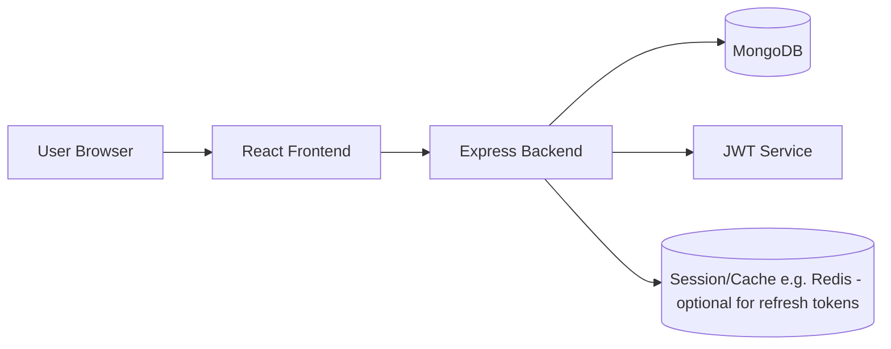
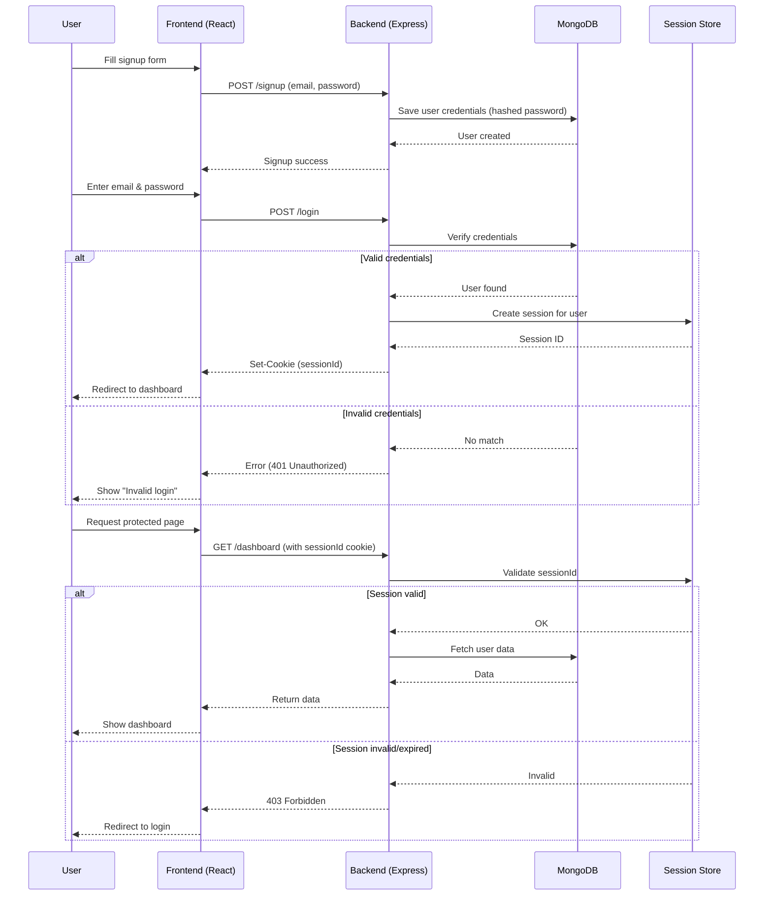

# E-Commerce Fullstack App

A modern, full-featured e-commerce application built using the MERN stack with a Vite-powered React frontend and an Express/Node.js backend connected to MongoDB.

## ShoppYnow Authentication System design



## Features

- **User Authentication**: Register, login, and manage accounts securely.
- **Product Management**: Admin can add, edit, or remove products.
- **Product Catalog**: Browse, search, and filter products.
- **Shopping Cart**: Add products to cart, update quantities, remove items.
- **Order Management**: Place orders, view order history, and manage orders (admin).
- **Payment Integration**: (Plug your preferred gateway here, e.g., Stripe/PayPal).
- **Responsive Design**: Mobile-friendly UI.
- **REST API**: Robust backend API for data management.

## Tech Stack

### Frontend

- [React](https://react.dev/) 
- [Vite](https://vitejs.dev/)
- [React Router](https://reactrouter.com/)
- [Redux Toolkit](https://redux-toolkit.js.org/) (optional for state management)
- [Axios](https://axios-http.com/) for HTTP requests
- [Tailwind CSS](https://tailwindcss.com/) or [Bootstrap](https://getbootstrap.com/) for styling (choose one)

### Backend

- [Node.js](https://nodejs.org/)
- [Express.js](https://expressjs.com/)
- [MongoDB](https://www.mongodb.com/) (with [Mongoose](https://mongoosejs.com/))
- [JWT](https://jwt.io/) for authentication

---

## Getting Started

### Prerequisites

- Node.js (v18+ recommended)
- NPM/Yarn
- MongoDB (local or Atlas)

### Installation

#### 1. Clone the repository

```bash
git clone https://github.com/DIPAKK2310/ShoppYnow.git
cd ShoppYnow
```

#### 2. Install dependencies

**Frontend:**

```bash
cd frontend/vite-project
npm install
# or
yarn install
```

**Backend:**

```bash
cd backend
npm install
# or
yarn install
```

#### 3. Environment Variables

Create a `.env` file in the `server/` directory:

```env
PORT=5000
MONGO_URI=your_mongodb_connection_string
JWT_SECRET=your_jwt_secret
# Add any other secrets or configs
```

For the frontend (if needed), create a `.env` in `client/`:

```env
VITE_API_URL=http://localhost:4000/api
```

#### 4. Run the Application

**Backend:**

```bash
cd backend
npm run dev
```

**Frontend:**

```bash
cd forntend/vite-project
npm run dev
```

The frontend will run on `http://localhost:5173` (default Vite port) and the backend on `http://localhost:4000` (default Express port).

---

## Project Structure

```
ecommerce-mern/
├── frontend/vite-project/        # Frontend (Vite + React)
├── backend/        # Backend (Node + Express + MongoDB)
└── README.md
```


---

## API Endpoints

- `POST /api/auth/register` - Register a new user
- `POST /api/auth/login` - User login
- `GET /api/products` - List all products
- `POST /api/products` - Create product (admin)
- `PUT /api/products/:id` - Update product (admin)
- `DELETE /api/products/:id` - Delete product (admin)
- `POST /api/orders` - Place a new order
- `GET /api/orders/user` - Get user orders
- `GET /api/orders` - Get all orders (admin)

*(You may expand this list to match your implementation.)*

---
## Authentication Flow



## Contributing

Contributions are welcome! Please open issues or pull requests for improvements or bug fixes.

## License

This project is licensed under the [MIT License](LICENSE).

---

## Acknowledgements

- [React](https://react.dev/)
- [Vite](https://vitejs.dev/)
- [Express](https://expressjs.com/)
- [MongoDB](https://www.mongodb.com/)
- [Node.js](https://nodejs.org/)
